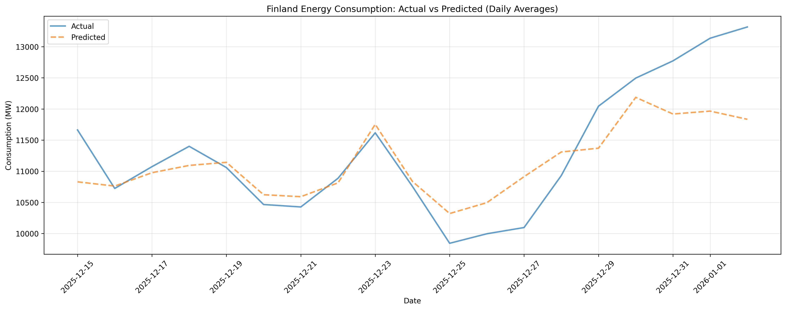
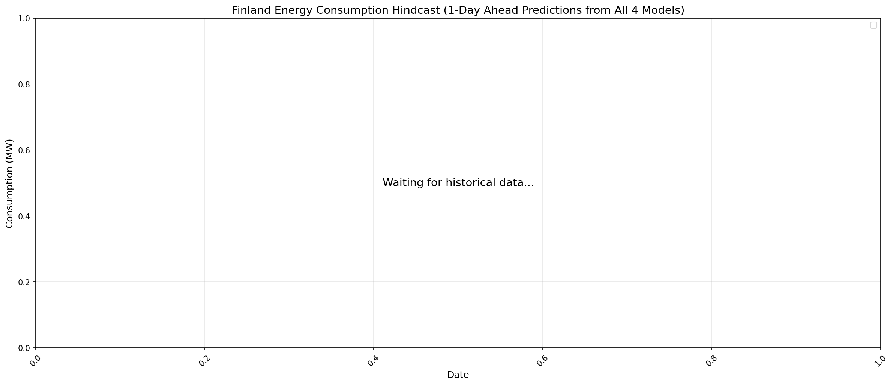
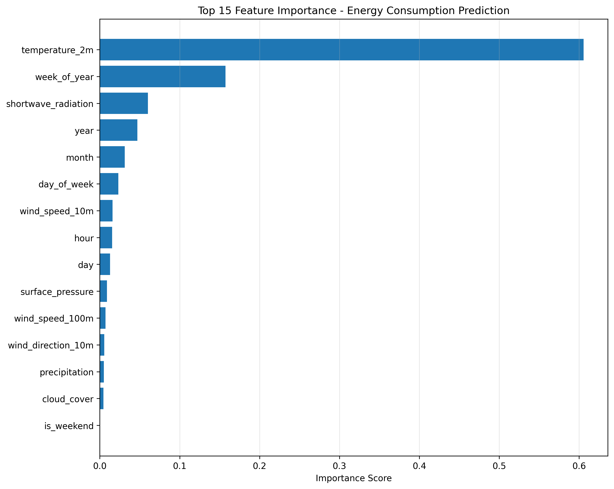
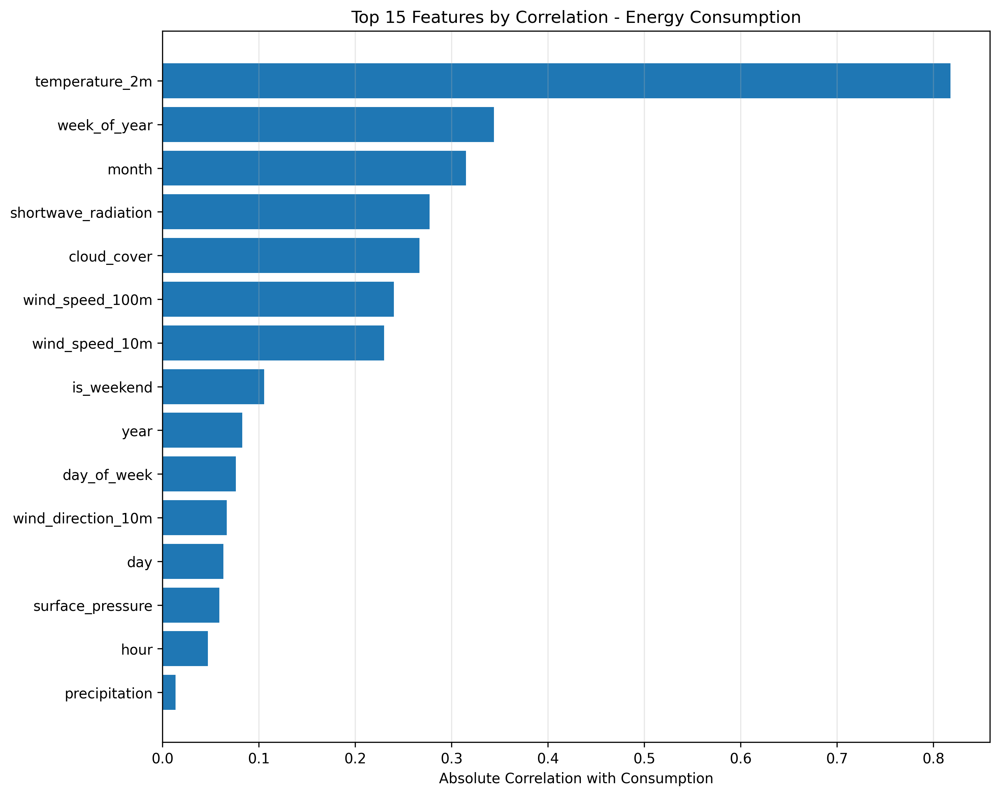
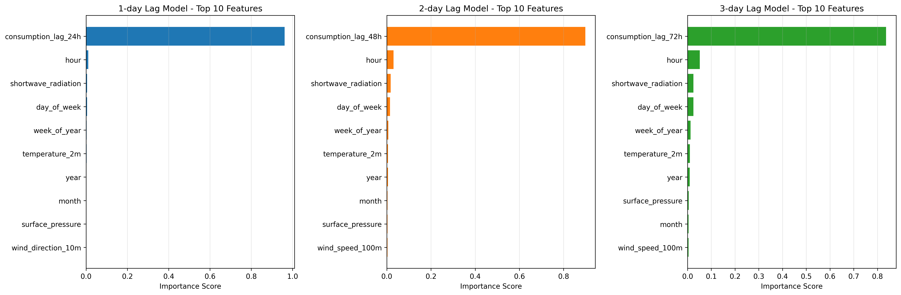
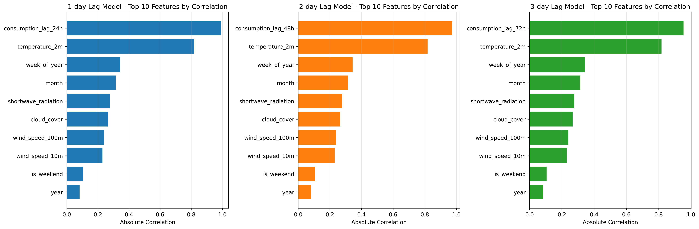

# Finland Energy Consumption Dashboard



## 7-Day Forecast

## Model Performance on Test Data

## Hindcast - All 4 Models Predictions vs Actual

Compares 1-day-ahead predictions from all 4 models (baseline and lag-based variants) against actual consumption values over historical periods. This validates each model's ability to predict consumption patterns and shows how different lag features impact prediction accuracy over time.

## Model Analysis - Baseline Model

### Feature Importance

### Feature Correlation

## Model Analysis - Lag Models

### Feature Importance Comparison

### Feature Correlation Comparison

This dashboard displays the 7-day forecast for Finland's electricity consumption using:
- **Fingrid API**: Real-time energy consumption data (3-minute intervals)
- **Open-Meteo API**: Weather forecast data (temperature, wind, precipitation, etc.)
- **XGBoost Model**: Machine learning model trained on historical consumption patterns

The forecast is updated daily at 6:15 AM UTC through automated GitHub Actions workflows.

## Data Sources

- **Energy Data**: Fingrid Open Data Hub - Dataset 193 (Electricity consumption in Finland)
- **Weather Data**: Open-Meteo Forecast API (Helsinki coordinates)
- **Feature Store**: Hopsworks Feature Store for data versioning and orchestration

## Model Features

The model uses temporal and weather features:
- Temporal: hour, day, month, day of week, weekend indicator, week of year (with cyclic encoding)
- Weather: temperature, wind speed/direction, precipitation, cloud cover, pressure, solar radiation
